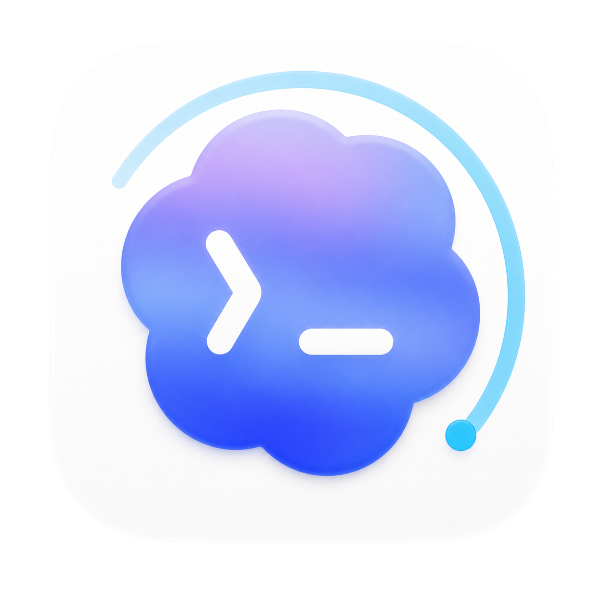

# Codex Usage Monitor

<p align="center">
  
</p>

<p align="center">
  原生 macOS 菜单栏 Codex 用量监控器
</p>

> [!IMPORTANT]
> 本项目是独立开发的非官方工具，与 OpenAI 无隶属、授权或背书关系。Codex、ChatGPT 及 OpenAI 是其各自权利人的商标。

当前版本：**2.0.13（Build 45）**  
系统要求：**macOS 15 Sequoia 至 macOS 27 测试版**  
架构：**Apple Silicon（arm64）**

## 核心功能

- 菜单栏实时显示 Codex 主额度剩余比例和重置倒计时；
- 菜单栏弹窗展示主额度、Credits、使用限制重置次数、今日 Token 与数据来源状态；
- Credits 剩余额度统一保留两位小数；
- 完整 Dashboard 提供 Overview、Usage History、Alerts、Data Source、Settings 五个页面；
- 支持本机 Codex 登录数据源，优先读取这台 Mac 已登录的 Codex 额度信息；
- 支持应用内 OpenAI 官方页面登录作为回退数据源；
- 支持本机实时今日 Token 统计，只读取结构化 `token_count` 事件；
- 支持自动刷新频率：智能、1 分钟、5 分钟、10 分钟；
- 支持缓存、估算、离线、不可用、耗尽、刷新中等明确状态；
- 支持额度历史、趋势图、重置检测和用量提醒；
- 支持 Light / Dark Mode、Reduce Transparency 和 VoiceOver；
- 登录态、历史快照、诊断信息均保存在本机。

## 菜单栏体验

- 状态项按额度剩余比例显示 `Codex 53% · 6d20h` 等紧凑文本；
- 无可靠额度时显示 `Codex --%`；
- 弹窗使用原生透明窗口承载，只显示当前圆角主面板；
- 圆角外不绘制额外矩形背景、系统底色或外层阴影；
- “刷新”会同步刷新额度与今日 Token；
- “完整面板”“Codex 登录”“OpenAI 登录”“设置”“退出”均可从弹窗直接进入。

## 数据来源

| 优先级 | 来源 | 内容 | 说明 |
|---:|---|---|---|
| 1 | 本机 Codex 登录 | 额度、Credits、重置窗口、套餐信息 | 需要用户授权，只调用本机已安装并已登录的 Codex |
| 2 | 应用内 OpenAI 官方页面 | 页面可见额度与实际返回的分析模块 | 使用隔离 WKWebView 会话，不复用浏览器 Cookie |
| 3 | SwiftData 缓存 | 先前读取成功的真实快照 | 界面会标明缓存新鲜度 |
| 4 | 本地估算 | 主额度短期趋势 | 至少需要两个真实快照，并始终显示估算标识 |
| 5 | 本机 Token 事件 | 今日 Token、本机实时统计 | 只读取 `token_count` 事件，不读取消息正文 |

额度、Credits、Analytics 和今日 Token 可以来自不同来源。应用会保留每个模块的来源与可信度，缺失字段显示为暂无数据，不用 `0` 伪装未知值。

## 完整面板

- **Overview**：额度概览、套餐、重置窗口、今日 Token、刷新状态；
- **Usage History**：历史快照、趋势图、近期用量和重置记录；
- **Alerts**：额度阈值、用量提醒和通知状态；
- **Data Source**：本机 Codex、OpenAI 页面、缓存、估算与刷新诊断；
- **Settings**：刷新频率、登录启动、隐私、历史保留和本地数据管理。

## 隐私说明

- 不上传登录态、Cookie、Token、Session ID、提示词、回复或代码内容；
- 本机实时今日 Token 只扫描 `~/.codex/sessions` 中的结构化计数字段；
- Web 登录使用应用内隔离的 WebKit 会话；
- 诊断信息会对 Authorization、Cookie、Token、Session ID、Email 和敏感查询参数脱敏；
- 本项目不运行开发者中转服务器。

更多信息见 [隐私说明](Docs/Privacy.md)。

## 安装

1. 从 GitHub Release 下载最新 DMG；
2. 打开 DMG，将 **Codex Usage Monitor** 拖入 **Applications**；
3. 启动后点击菜单栏 `Codex` 状态项；
4. 如需本机 Codex 数据源，点击“Codex 登录”并确认本机 Codex 已登录；
5. 如需官方页面回退数据源，点击“OpenAI 登录”并在应用内页面完成登录；
6. 返回菜单栏点击“刷新”。

正式对外分发包需要 Developer ID Application 签名与 Apple 公证。仓库中本地测试包会标记为 `local-test`，仅用于开发验证。

## 从源码运行

```bash
git clone https://github.com/Geeklove666/CodexUsageMonitor.git
cd CodexUsageMonitor
swift build
swift test
swift run CodexUsageMonitor
```

macOS 27 beta 环境可显式使用匹配的 Xcode beta：

```bash
DEVELOPER_DIR=/Applications/Xcode-beta.app/Contents/Developer swift test
```

## 打包

正式发布：

```bash
CODESIGN_IDENTITY="Developer ID Application: Your Name (TEAMID)" \
NOTARY_PROFILE="notary-profile" \
Scripts/package-dmg.sh
```

本机开发验证：

```bash
ALLOW_ADHOC=1 Scripts/package-dmg.sh
```

脚本会生成 Apple Silicon DMG 和 SHA-256 校验文件，并验证最低 macOS 15。

## 项目文档

- [版本记录](CHANGELOG.md)
- [架构](Docs/Architecture.md)
- [数据源调查](Docs/DataSourceInvestigation.md)
- [隐私说明](Docs/Privacy.md)
- [安全策略](SECURITY.md)
- [贡献指南](CONTRIBUTING.md)
